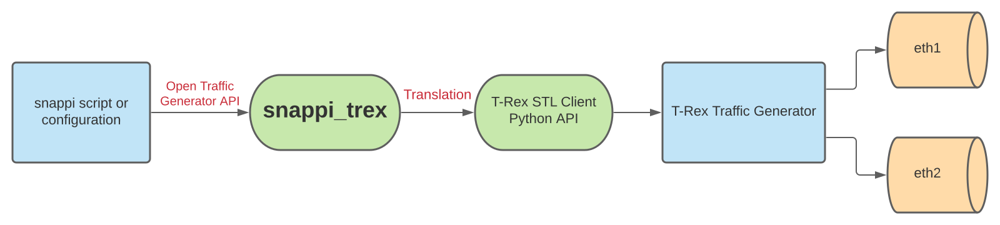

# snappi-trex

[](https://en.wikipedia.org/wiki/MIT_License)
[](https://www.repostatus.org/#active)
[](https://github.com/open-traffic-generator/snappi-trex/actions)
[](https://lgtm.com/projects/g/open-traffic-generator/snappi-trex/alerts/)
[](https://lgtm.com/projects/g/open-traffic-generator/snappi-trex/context:python)
[](https://pypi.org/project/snappi-trex)
[](https://pypi.python.org/pypi/snappi-trex)

snappi-trex is a snappi plugin that allows executing scripts written using 
[snappi](https://github.com/open-traffic-generator/snappi) with Cisco's [TRex Traffic Generator](https://trex-tgn.cisco.com)

## Design
snappi-trex converts snappi Open Traffic Generator API configuration into the equivalent TRex STL Client configuration. This allows users to use the TRex Traffic Generator and its useful features without having to write complex TRex scripts. 



The above diagram outlines the overall process of how the snappi Open Traffic Generator API is able to interface with TRex and generate traffic over its network interfaces. snappi-trex is essential to convert snappi scripts into the equivalent TRex STL Client instructions.

<br>

snappi-trex usage follows the standard usage of snappi with a few modifications outlined in the [Usage](docs/usage.md) document.


## Demos

### [Click here for the Quickstart Guide Video Tutorial](https://youtube.com/watch?v=ti8lWKhWCLE)
* This goes over the installation and setup for snappi-trex, and how to run a basic snappi script using snappi-trex

### [Click here for the snappi-trex P4 PTF Demo](https://youtube.com/watch?v=apnCB2lg6VY)
* This demonstrates snappi-trex being used with the P4 Packet Testing Framework in a 4 Port Mesh configuration

<br>

# Table of Contents
* [Quickstart](docs/quickstart.md)
* [TRex installation and setup](docs/trex-tutorial.md)
* [snappi-trex usage](docs/usage.md)
* [snappi-trex full features and limitations](docs/features.md)
* [Testing](docs/testing.md)
* [Contribute](docs/contribute.md)
* [Demos](docs/demos.md)

<br>

# Quickstart
snappi-trex is a snappi plugin that allows executing scripts written using 
[snappi](https://github.com/open-traffic-generator/snappi) with Cisco's [TRex Traffic Generator](https://trex-tgn.cisco.com)

<br>

## [--> Click here for the Quickstart Guide Video Tutorial](https://youtube.com/watch?v=ti8lWKhWCLE)
<br>

## Installing and Running TRex
### [TRex must be installed and running before proceeding](docs/trex-tutorial.md)
TRex must be installed and configured in order to use snappi-trex. For a quick tutorial on TRex installation, running, and basic usage, check out my [TRex Tutorial](docs/trex-tutorial.md)

<br>

## Installing snappi-trex
Make sure python-pip3 is installed
```sh
sudo apt-get install python3-pip
```
Install snappi and the snappi-trex extension
```sh
pip3 install snappi==0.4.26 snappi[trex]
```

## Start Scripting
Let's run our first script called `hello_snappi_trex.py`: A basic snappi script that transmits 1000 UDP packets bidirectionally between two ports and verifies that they are received. This file can be found at `examples/hello_snappi_trex.py` in the snappi-trex Github Repo.
```sh
git clone https://github.com/open-traffic-generator/snappi-trex
python3 snappi-trex/examples/hello_snappi_trex.py
```

<br>

You may also just paste the script in from below.
<details>
<summary>hello_snappi_trex.py</summary>

```
import snappi
import sys, os

# Replace v2.90 with the installed version of TRex. 
# Change '/opt/trex' if you installed TRex in another location
trex_path = '/opt/trex/v2.90/automation/trex_control_plane/interactive'
sys.path.insert(0, os.path.abspath(trex_path))


def hello_snappi_trex():
    """
    This script does following:
    - Send 1000 packets back and forth between the two ports at a rate of
      1000 packets per second.
    - Validate that total packets sent and received on both interfaces is as
      expected using port metrics.
    - Validate that captured UDP packets on both the ports are as expected.
    """
    # create a new API instance where host points to controller
    api = snappi.api(ext='trex')
    # and an empty traffic configuration to be pushed to controller later on
    cfg = api.config()

    # add two ports where location points to traffic-engine (aka ports)
    p1, p2 = (
        cfg.ports
        .port(name='p1')
        .port(name='p2')
    )

    # add layer 1 property to configure same speed on both ports
    ly = cfg.layer1.layer1(name='ly')[-1]
    ly.port_names = [p1.name, p2.name]
    ly.speed = ly.SPEED_1_GBPS

    # enable packet capture on both ports
    cp = cfg.captures.capture(name='cp')[-1]
    cp.port_names = [p1.name, p2.name]

    # add two traffic flows
    f1, f2 = cfg.flows.flow(name='flow p1->p2').flow(name='flow p2->p1')
    # and assign source and destination ports for each
    f1.tx_rx.port.tx_name, f1.tx_rx.port.rx_name = p1.name, p2.name
    f2.tx_rx.port.tx_name, f2.tx_rx.port.rx_name = p2.name, p1.name

    # configure packet size, rate and duration for both flows
    f1.size.fixed, f2.size.fixed = 128, 256
    for f in cfg.flows:
        # send 1000 packets and stop
        f.duration.fixed_packets.packets = 1000
        # send 1000 packets per second
        f.rate.pps = 1000

    # configure packet with Ethernet, IPv4 and UDP headers for both flows
    eth1, ip1, udp1 = f1.packet.ethernet().ipv4().udp()
    eth2, ip2, udp2 = f2.packet.ethernet().ipv4().udp()

    # set source and destination MAC addresses
    eth1.src.value, eth1.dst.value = '00:AA:00:00:04:00', '00:AA:00:00:00:AA'
    eth2.src.value, eth2.dst.value = '00:AA:00:00:00:AA', '00:AA:00:00:04:00'

    # set source and destination IPv4 addresses
    ip1.src.value, ip1.dst.value = '10.0.0.1', '10.0.0.2'
    ip2.src.value, ip2.dst.value = '10.0.0.2', '10.0.0.1'

    # set incrementing port numbers as source UDP ports
    udp1.src_port.increment.start = 5000
    udp1.src_port.increment.step = 2
    udp1.src_port.increment.count = 10

    udp2.src_port.increment.start = 6000
    udp2.src_port.increment.step = 4
    udp2.src_port.increment.count = 10

    # assign list of port numbers as destination UDP ports
    udp1.dst_port.values = [4000, 4044, 4060, 4074]
    udp2.dst_port.values = [8000, 8044, 8060, 8074, 8082, 8084]

    print('Pushing traffic configuration ...')
    api.set_config(cfg)

    print('Starting packet capture on all configured ports ...')
    cs = api.capture_state()
    cs.state = cs.START
    api.set_capture_state(cs)

    print('Starting transmit on all configured flows ...')
    ts = api.transmit_state()
    ts.state = ts.START
    api.set_transmit_state(ts)

    print('Checking metrics on all configured ports ...')
    print('Expected\tTotal Tx\tTotal Rx')
    assert wait_for(lambda: metrics_ok(api, cfg)), 'Metrics validation failed!'

    assert captures_ok(api, cfg), 'Capture validation failed!'

    print('Test passed !')


def metrics_ok(api, cfg):
    # create a port metrics request and filter based on port names
    req = api.metrics_request()
    req.port.port_names = [p.name for p in cfg.ports]
    # include only sent and received packet counts
    req.port.column_names = [req.port.FRAMES_TX, req.port.FRAMES_RX]

    # fetch port metrics
    res = api.get_metrics(req)
    # calculate total frames sent and received across all configured ports
    total_tx = sum([m.frames_tx for m in res.port_metrics])
    total_rx = sum([m.frames_rx for m in res.port_metrics])
    expected = sum([f.duration.fixed_packets.packets for f in cfg.flows])

    print('%d\t\t%d\t\t%d' % (expected, total_tx, total_rx))

    return expected == total_tx and total_rx >= expected


def captures_ok(api, cfg):
    import dpkt
    print('Checking captured packets on all configured ports ...')
    print('Port Name\tExpected\tUDP packets')

    result = []
    for p in cfg.ports:
        exp, act = 1000, 0
        # create capture request and filter based on port name
        req = api.capture_request()
        req.port_name = p.name
        # fetch captured pcap bytes and feed it to pcap parser dpkt
        pcap = dpkt.pcap.Reader(api.get_capture(req))
        for _, buf in pcap:
            # check if current packet is a valid UDP packet
            eth = dpkt.ethernet.Ethernet(buf)
            if isinstance(eth.data.data, dpkt.udp.UDP):
                act += 1

        print('%s\t\t%d\t\t%d' % (p.name, exp, act))
        result.append(exp == act)

    return all(result)


def wait_for(func, timeout=10, interval=0.2):
    """
    Keeps calling the `func` until it returns true or `timeout` occurs
    every `interval` seconds.
    """
    import time
    start = time.time()

    while time.time() - start <= timeout:
        if func():
            return True
        time.sleep(interval)

    print('Timeout occurred !')
    return False


if __name__ == '__main__':
    hello_snappi_trex()

```
</details>

<br>

### Output

If everything is working correctly, you should see a similar output as this.
```
Pushing traffic configuration ...
Starting packet capture on all configured ports ...
Starting transmit on all configured flows ...
Checking metrics on all configured ports ...
Expected        Total Tx        Total Rx
2000            19              17
2000            445             437
2000            881             881
2000            1325            1325
2000            1761            1761
2000           2000            2000
Checking captured packets on all configured ports ...
Port Name       Expected        UDP packets
p1              1000            1000
p2              1000            1000
Test passed !
```